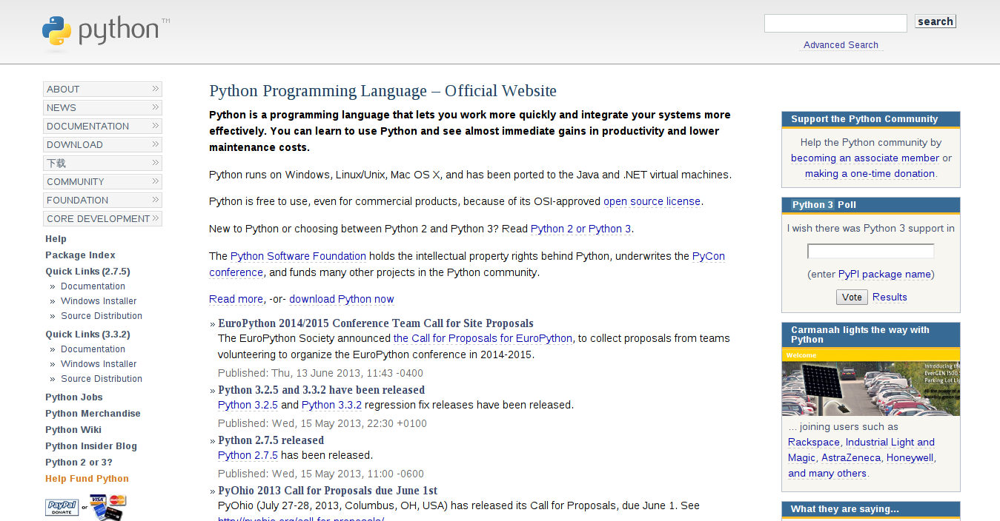

# 上网的选择 #

* 电信
* 教育网
* 网通
* 联通
* 铁通
* 有线通
* 其他

## 现象 ##

1. 有的时候打网游总是掉线。
2. 有些网页也偶尔会打不开。
3. 有时下载总是有点奇奇怪怪的毛病。
4. 在电信没事。

## 测试1 ##

下面是同一个机房同一个机架上的网通和电信服务器，从电信用户处ping的测试结果。

电信

	26 packets transmitted, 26 received, 0% packet loss, time 25038ms
	rtt min/avg/max/mdev = 4.292/5.536/8.446/0.859 ms

网通

	21 packets transmitted, 21 received, 0% packet loss, time 20028ms
	rtt min/avg/max/mdev = 129.111/132.009/134.310/1.234 ms

作为对比，这是同一用户mtr niconico在日本的服务器。

niconico in jp

	HOST: e135                        Loss%   Snt   Last   Avg  Best  Wrst StDev
	16.|-- 203.192.149.78             0.0%    10  127.1 127.2 125.2 129.7   1.4

## 原因 ##

在大陆地区，跨越全国的核心主干网有很多。但是公开主干网络只有两三家，电信，网通，教育网。其余都是些比较小的运营商。

根据电信拆分方案，早些年电信所拥有的网络被拆分成两家。南方的归电信，北方的划入网通。电信当然不愿意有那么多竞争者，但是要连不通问题更大。于是，在非公开的记录下，电信做了一点小小的调整。

电信把通往其他ISP的数据报文优先级调整到最低，比出国还低。

所以如果在夜深人静没人用网络的时候，两者的速度就没什么太大区别了。。。

这就是大陆网络第一怪——双线问题。

## 测试2 ##

我们测试一下路由，看看哪里是慢的关键。

电信

	HOST: e135                        Loss%   Snt   Last   Avg  Best  Wrst StDev
	  1.|-- 192.168.1.1                0.0%    10    1.5   1.8   1.5   2.6   0.3
	  2.|-- 124.74.56.20               0.0%    10    5.9   4.7   2.8  13.8   3.3
	  3.|-- 124.74.57.225              0.0%    10    4.1   5.9   3.4  15.6   3.7
	  4.|-- 124.74.209.5               0.0%    10    4.0   5.7   3.8  14.7   3.4
	  5.|-- 61.152.80.10               0.0%    10   13.9  15.2   5.7  32.9   7.0
	  6.|-- 222.73.53.86               0.0%    10    8.7   7.7   4.1  13.7   3.2
	  7.|-- 222.73.241.18              0.0%    10   19.6   8.0   5.8  19.6   4.1
	  8.|-- 114.80.227.14              0.0%    10  150.3 149.2 143.1 160.9   5.7
	  9.|-- 114.80.227.153             0.0%    10    5.0   5.9   4.6   7.7   1.0

---

网通

	HOST: e135                        Loss%   Snt   Last   Avg  Best  Wrst StDev
	  1.|-- 192.168.1.1               20.0%    10    1.9   1.8   1.5   2.1   0.3
	  2.|-- 124.74.56.20               0.0%    10    3.7   4.1   3.2   8.1   1.4
	  3.|-- 124.74.57.229              0.0%    10    3.6   4.4   3.4   5.6   0.7
	  4.|-- 124.74.215.53              0.0%    10    4.2   5.5   4.2  13.9   3.0
	  5.|-- 202.101.63.138             0.0%    10    5.0   5.2   4.5   5.7   0.4
	  6.|-- 202.97.48.26               0.0%    10    7.8   7.5   5.0  11.4   1.8
	  7.|-- 202.97.15.226              0.0%    10  126.8 130.0 126.3 138.6   3.6
	  8.|-- 219.158.96.117             0.0%    10  131.2 133.9 128.6 159.1   8.9
	  9.|-- 219.158.98.146            30.0%    10  146.0 137.4 134.7 146.0   4.2
	 10.|-- 112.64.243.82             60.0%    10  133.7 136.2 131.8 140.4   4.1
	 11.|-- 112.64.252.210             0.0%    10  140.7 135.8 133.8 140.7   2.2
	 12.|-- 112.65.224.98             10.0%    10  218.2 208.2 152.1 331.1  59.7
	 13.|-- 112.65.229.2              10.0%    10  130.8 131.1 129.8 133.3   1.0

---

我们whois一下每个节点。注意到电信到网通最慢的点，刚好在电信的骨干网内部最后一跳上，而不是电信路由器到网通路由器之间。

202.97.48.26

202.97.15.226

	inetnum:        202.97.0.0 - 202.97.31.255
	netname:        CHINANET-BB
	descr:          CHINANET backbone network

实际上这倒是不足为奇。电信到google在美国机房的mtr表明，出国光纤延迟还没有电信最后一跳延迟大。当然，这个最后一跳正在做什么就不足为外人道了。

## 如果你是网站的工程师 ##

* 双线双IP
* BGP

但是价格。。。

* 电信：100RMB/Mbps/mo 470NTD/Mbps/mo
* BGP：300RMB/Mbps/mo 1410NTD/Mbps/mo

如果机器比较多，在电信和网通分别放一个机器比一个BGP机器更加便宜。所以开始我才举有线通的例子。因为网通用户也很多，很多站点为了网通也做了优化，所以有的时候网通用户并不能察觉问题。相反，有线通用户更少，很多网站不给有线通做优化。

但是有线通还得活，所以他们出台了另一个神奇的东西。

# 运营商缓存 #

## 现象 ##

V2EX的控诉帖：

1. 当这名用户在有线通去下载淘宝最新的程序时，下载到的永远是旧的。
2. 电信的下载到的则是最新的。

## 原理 ##

1. 大部分网站都是电信或网通的。电信和网通的访问都慢，用户觉得慢就会跑。
2. 有线通要生存，他们想花钱解决这个问题无法解决。为了解决这个问题，有线通对大文件下载都做了ISP级transparent proxy。
3. 当你下载一个文件的时候，拿到的是代理上的版本。这只消耗你到有线通运营商之间的流量，而不影响电信出口带宽。
4. 很多网站的Modify信息很有问题，cache参数要么没指定，要么胡乱指定。robots和sitemap也写的一塌糊涂。
5. 上面的问题，就是代理超时时间设定太长给用户造成的困扰。

---

当然极具喜感的是，那个贴的下面，有线通的技术人员出面道歉，并且告知——只要你把那台服务器设定为代理，就可以下载到真实的内容，还不受到速度限制——这种秘技。

——专业卖队友三十年。

# 为什么大陆的网站都那么多广告 #

## 现象 ##

1. 自己的部落格出现了广告！我有收到钱吗？
2. google和百度首页也有广告？
3. 在新疆的同学们，为什么希望访问京东（大陆的一个电子商务网站），出现的却是这个叫做yiqifa.com的网站？

---

---

---

## 原理 ##

其实只要理解了运营商代理缓存，就能理解运营商广告，因为两者的技术原理是一样的。

这玩意电信叫做定向广告投放系统。就是拦截你的http请求，抢在服务器之前回复内容。术语叫做http会话劫持。你以为是站点给你的内容，其实是电信给你的。内容就是你的站点+广告。

## 解法 ##

这个不难解决。你先打给电信投诉。等几天后，如果还有，再打给工信部(这个机构你可能都没听说过，不过没关系，下面你会经常听到)投诉。电信会把你加入名单，你就没事了。

但是如果你是网站工作人员，事情就比较悲剧。工信部不允许网站主办者投诉针对自己的域名劫持事件。要求网站主去和ISP商量。

去。和中国电信商量的出什么东西来。

# The Great Fire Well #

## 原理 ##

GFW全称The Great Fire Well，是位于出入境边界上的一套IDS系统。他具备以下功能。

* DNS劫持：对于某些域名，境内DNS服务器里强行存入错误的结果。
* DNS污染：如果你查询国外的DNS服务器，抢先给你错误的结果。
* IP丢弃：IP地址不好就把包丢掉。
* 深度包检测和内容过滤：如果HTTP请求里面有些怪怪的东西就给双方各自一个RST。
* 协议和流量分析模型：这个数据流模式看起来像是http？那可能就是http的某个包装。
* 可疑内容加大丢包率：看起来很可疑，多丢个10%的包试试。

将来随时可能实施的还有：

* 白名单功能：除了能够访问的，就是不能访问的。

## 测试1 ##

我们做一个很简单的实验来观测dns污染和劫持。

	$ dig www.facebook.com

	;; QUESTION SECTION:
	;www.facebook.com.		IN	A

	;; ANSWER SECTION:
	www.facebook.com.	300	IN	A	159.106.121.75

---

	$ whois 159.106.121.75

	NetRange:       159.106.0.0 - 159.106.255.255
	CIDR:           159.106.0.0/16
	OrgName:        DoD Network Information Center
	OrgId:          DNIC
	Address:        3990 E. Broad Street
	City:           Columbus
	Country:        US

---

	$ whois 31.13.70.17

	inetnum:        31.13.64.0 - 31.13.127.255
	netname:        IE-FACEBOOK-20110418
	descr:          Facebook Ireland Ltd
	country:        IE
	org-name:       Facebook Ireland Ltd
	org-type:       LIR

## 测试2 ##

我们下面来看看DNS劫持。

	$ dig www.facebook.com @8.8.8.8

	;; QUESTION SECTION:
	;www.facebook.com.		IN	A

	;; ANSWER SECTION:
	www.facebook.com.	300	IN	A	59.24.3.173

## 测试3 ##

我们下面看看IP丢弃。

	$ ping 31.13.70.17

	PING 31.13.70.17 (31.13.70.17) 56(84) bytes of data.
	64 bytes from 31.13.70.17: icmp_req=1 ttl=243 time=10.9 ms
	64 bytes from 31.13.70.17: icmp_req=2 ttl=243 time=12.3 ms

	--- 31.13.70.17 ping statistics ---
	2 packets transmitted, 2 received, 0% packet loss, time 1001ms
	rtt min/avg/max/mdev = 10.983/11.678/12.373/0.695 ms

下面是上海地区的。

	$ ping 31.13.70.17
	PING 31.13.70.17 (31.13.70.17) 56(84) bytes of data.

	--- 31.13.70.17 ping statistics ---
	2 packets transmitted, 0 received, 100% packet loss, time 999ms

---

	$ mtr -n -r -c 10 31.13.70.17

	HOST: e135                        Loss%   Snt   Last   Avg  Best  Wrst StDev
	  1.|-- 192.168.1.1                0.0%    10    2.0  12.8   1.7 112.0  34.8
	  2.|-- 124.74.56.20               0.0%    10    3.9  12.4   3.0  81.3  24.3
	  3.|-- 124.74.57.229              0.0%    10    3.4   4.1   3.3   5.1   0.7
	  4.|-- 124.74.215.53              0.0%    10    3.7   4.6   3.6   6.7   1.1
	  5.|-- 202.101.63.242             0.0%    10    8.1   7.1   5.8   8.8   1.1
	  6.|-- 202.97.50.238              0.0%    10    5.0   5.4   4.2   8.5   1.2
	  7.|-- ???                       100.0    10    0.0   0.0   0.0   0.0   0.0

这里出现了一个奇怪的ip，202.97.50.238。whois显示这个ip不是中国电信的（至少不直接是）。在经过这个ip后，报文就丢失了。

	$ whois 202.97.50.238

	inetnum:        202.97.50.0 - 202.97.50.255
	netname:        FSKWC
	descr:          FSKWC NET

## 测试4 ##

我们下面看看深度包检测。

	$ wget http://python.org
	--2013-08-02 23:12:16--  http://python.org/
	正在解析主机 python.org (python.org)... 82.94.164.162, 2001:888:2000:d::a2
	正在连接 python.org (python.org)|82.94.164.162|:80... 已连接。
	已发出 HTTP 请求，正在等待回应... 200 OK

需要特别说明的是，目前python.org的下载已经不被封锁，下面这个结果是前年的。

	$ wget http://python.org/download/

	正在解析主机 python.org (python.org)... 82.94.164.162, 2001:888:2000:d::a2
	正在连接 python.org (python.org)|82.94.164.162|:80... 已连接。
	已发出 HTTP 请求，正在等待回应... 读取文件头错误 (Connection reset by peer)。
	重试中。

## 吐槽 ##

* python.org为啥被封
  1. python.com误中副车说。
  2. 版本号说。
  3. 工具说。
* python.org的反应

---

## 解法 ##

买翻墙VPN。

不要买太久，三个月到半年差不多了。两三年来，收费翻墙系统已经有三拨大的潮流了。

1. 开始是ssh。后来GFW升级了协议和流量分析模型，ssh里面传大量数据就会丢包，ssh挂掉。
2. 后来流行过openvpn。openvpn是基于ssl协议的，很快被抓住，挂掉。
3. 目前是pptp和l2tp，开始没人要玩的东西。因为这些协议会产生gre或者esp，ah之类的报文，在路由器上需要特殊的设定。但是由于这两种协议在商业上用的太多(windows中内置支持)，因此要一次性断开会导致很多外企无法工作。目前还没有下手。
4. pptp很危险，因为他的安全性比l2tp差。有传闻说pptp所用的mppe40位加密已经遭到破解，mppe128安全性未知。

## 路由分离方案 ##

路由分离方案在有些地方也叫智能路由，其实和智能一毛钱关系都没有。

路由分离方案指的是，在NIC里可以查询到IPv4网段归属表。在这基础之上，将所有大陆的IP段配置成直接访问，非大陆IP段配置成vpn访问。这样可以有效减小无谓的vpn流量，而且可以避免vpn返流造成的缓慢，语言错误，再次穿越gfw造成的断开等问题。

现在大部分路由分离方案，都是源自chnroutes这个项目。这个项目的代码从nic上面下载最新的网段分配表，进行加工处理，产生可以用于各种环境的路由表配置文件。很多路由器或vpn中，配置了当vpn拨号后自动应用的路由表配置文件，并且保持配置文件一个月升级一次。

## 免费翻墙方案 ##

一天一换，请自行烦恼。

* goagent
* obfuscated-openssh
* shadowsocks
* openvpn混淆补丁
* 其他方案
  * 我自己写的goproxy
  * 朋友写的openvpn跳频加密

# 备案机制 #

备案是一项很扯的机制，细节就不介绍了。大概来说，就是去有关部门（别问我是哪里，有可能是工信部）注册自己为某个域名的所有者。这样，当网站出现问题的时候，可以反向查找到人。

## 备案白名单机制 ##

目前很多机房已经实施了备案白名单。当你通过备案，资料可查的时候。IDC机房的人才会把你的域名加入他们的防火墙白名单里去。如果有用户以白名单以外的域名，对机房的IP进行HTTP访问，就会收到两个RST。

## 问题 ##

至少到三年前为止（这两年在大陆没机器了，不大清楚），个人注册备案是需要身份证字号的。一个字号可以注册多个域名，可是——不能改！

到不是真的不能改。但是网站上给出的功能中没有修改，要修改必须到指定的地址提交书面材料。我的某位朋友曾经打算多注册几个域名屯起来，结果发现无法增加。后来觉得麻烦，就用他老婆的字号注册。我最后一次听说的时候，他刚三岁的儿子已经有个几个域名，我不知道孩子将来大了会不会埋怨父亲给自己找麻烦。。。

## 可能发生的问题 ##

呃，如果将来有人提出，要让大陆境外所有站点在大陆通过备案才允许访问，我一点都不会奇怪。这就是合法的白名单机制。
