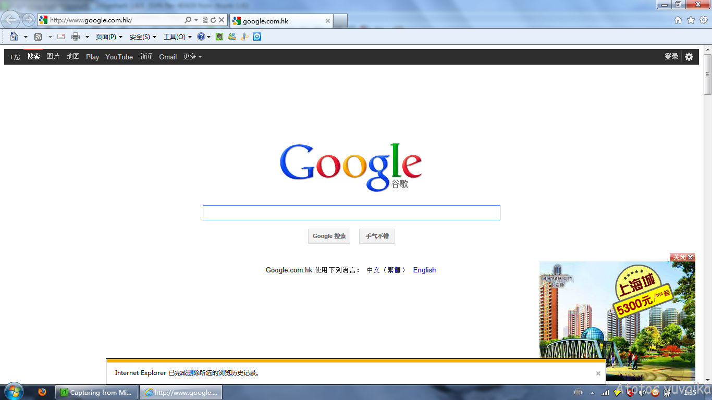
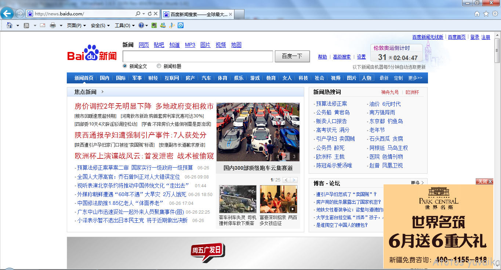
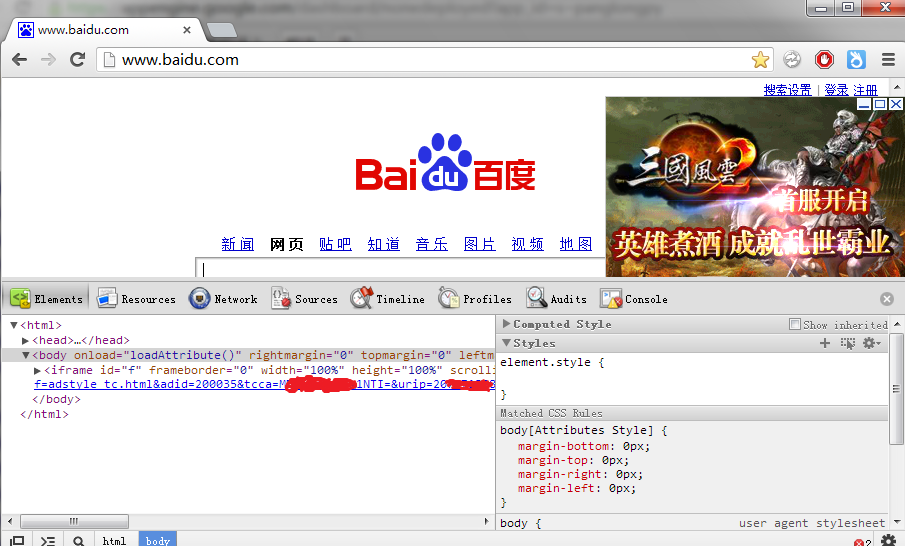

# 上网的选择 #

在大陆，有很多ISP（电信供应商），你可以选择一家提供网络连接。

* 电信
* 教育网
* 网通
* 联通
* 铁通
* 有线通
* 其他提供商

在上海，电信非常贵，其他ISP则相对物美价廉。

## 现象 ##

例如你选择了有线通。他们是使用有线电视线来传递信号的。你先要向他们申请，然后工程师会上门拉线，安装一只盒子，给你一根网线。bingo，你能上网了，看起来不错。

大多时候都没什么问题，就是有的时候打网游总是掉线，有些网页也偶尔会打不开。

然后呢。有天，你拜访一位朋友家里。突然发现。为什么有些你那里打开很慢的网页他那里瞬间打开。网游也不卡了。

这是为什么？

## 原因 ##

在大陆地区，跨越全国的核心主干网有很多。但是公开主干网络只有两三家，电信，网通，教育网。其余都是些比较小的运营商。

根据当年电信拆分方案，电信所拥有的网络被拆分成两家。南方的归电信，北方的划入网通。电信当然不愿意有那么多竞争者，但是要连不通问题更大。于是，在非公开的记录下，电信做了一点小小的调整。

好吧，说小调整也许过分。但是电信到网通的信号质量和两者内部质量之差，世所罕见。更过分的是，这么多年来，问题基本未见好转。

## 测试 ##

所有电信网络，到网通，铁通的访问，都会比电信内部访问慢。当然，如果从网通访问电信，也会出现类似问题。根据电信官方说法，这是因为网通的线路需要多几跳路由器。

——你的路由器是有多烂才会慢成这个奇怪的样子阿。。。

---

下面是同一个机房同一个机架上的网通和电信服务器，从电信用户处ping的测试结果。

电信

	26 packets transmitted, 26 received, 0% packet loss, time 25038ms
	rtt min/avg/max/mdev = 4.292/5.536/8.446/0.859 ms

网通

	21 packets transmitted, 21 received, 0% packet loss, time 20028ms
	rtt min/avg/max/mdev = 129.111/132.009/134.310/1.234 ms

---

作为对比，这是同一用户mtr niconico在日本的服务器。

niconico in jp

	HOST: e135                        Loss%   Snt   Last   Avg  Best  Wrst StDev
	16.|-- 203.192.149.78             0.0%    10  127.1 127.2 125.2 129.7   1.4

---

我们测试一下路由，看看为什么跳到网通比跳到日本还慢。

	mtr -n -r -c 10 ipaddr

电信

	HOST: e135                        Loss%   Snt   Last   Avg  Best  Wrst StDev
	  1.|-- 192.168.1.1                0.0%    10    1.5   1.8   1.5   2.6   0.3
	  2.|-- 124.74.56.20               0.0%    10    5.9   4.7   2.8  13.8   3.3
	  3.|-- 124.74.57.225              0.0%    10    4.1   5.9   3.4  15.6   3.7
	  4.|-- 124.74.209.5               0.0%    10    4.0   5.7   3.8  14.7   3.4
	  5.|-- 61.152.80.10               0.0%    10   13.9  15.2   5.7  32.9   7.0
	  6.|-- 222.73.53.86               0.0%    10    8.7   7.7   4.1  13.7   3.2
	  7.|-- 222.73.241.18              0.0%    10   19.6   8.0   5.8  19.6   4.1
	  8.|-- 114.80.227.14              0.0%    10  150.3 149.2 143.1 160.9   5.7
	  9.|-- 114.80.227.153             0.0%    10    5.0   5.9   4.6   7.7   1.0

---

网通

	HOST: e135                        Loss%   Snt   Last   Avg  Best  Wrst StDev
	  1.|-- 192.168.1.1               20.0%    10    1.9   1.8   1.5   2.1   0.3
	  2.|-- 124.74.56.20               0.0%    10    3.7   4.1   3.2   8.1   1.4
	  3.|-- 124.74.57.229              0.0%    10    3.6   4.4   3.4   5.6   0.7
	  4.|-- 124.74.215.53              0.0%    10    4.2   5.5   4.2  13.9   3.0
	  5.|-- 202.101.63.138             0.0%    10    5.0   5.2   4.5   5.7   0.4
	  6.|-- 202.97.48.26               0.0%    10    7.8   7.5   5.0  11.4   1.8
	  7.|-- 202.97.15.226              0.0%    10  126.8 130.0 126.3 138.6   3.6
	  8.|-- 219.158.96.117             0.0%    10  131.2 133.9 128.6 159.1   8.9
	  9.|-- 219.158.98.146            30.0%    10  146.0 137.4 134.7 146.0   4.2
	 10.|-- 112.64.243.82             60.0%    10  133.7 136.2 131.8 140.4   4.1
	 11.|-- 112.64.252.210             0.0%    10  140.7 135.8 133.8 140.7   2.2
	 12.|-- 112.65.224.98             10.0%    10  218.2 208.2 152.1 331.1  59.7
	 13.|-- 112.65.229.2              10.0%    10  130.8 131.1 129.8 133.3   1.0

---

我们whois一下每个节点。注意到电信到网通最慢的点，刚好在电信的骨干网内部最后一跳上，而不是电信路由器到网通路由器之间。

202.97.48.26
202.97.15.226

	inetnum:        202.97.0.0 - 202.97.31.255
	netname:        CHINANET-BB
	descr:          CHINANET backbone network

219.158.96.117
219.158.98.146

	inetnum:        219.158.0.0 - 219.158.255.255
	netname:        CNCGROUP
	descr:          CNC group

实际上这倒是不足为奇。电信到google在美国机房的mtr表明，出国光纤延迟还没有电信最后一跳延迟大。当然，这个最后一跳正在做什么就不足为外人道了。

---

这就是大陆网络第一怪——双线问题。

## 如果你是网站的工程师 ##

当然，这个问题也不是没解法。我们可以在机房里面同时接入电信和网通的线路。然后就有两种技术，双线双IP，或者BGP。两种技术都能够有效解决网络访问慢的问题，但是。。。

花钱也很大。

一个做类似生意的朋友告诉我，大陆电信机房大约是100RMB/Mbps/mo，网通价格估计也差不多。而BGP的价格在300RMB/Mbps/mo以上。如果机器比较多，在电信和网通分别放一个机器比一个BGP机器更加便宜。

---

所以开始我才举有线通的例子。因为网通用户也很多，很多站点为了网通也做了优化，所以有的时候网通用户并不能察觉问题。相反，有线通用户更少，很多网站不给有线通做优化。

但是有线通还得活阿。所以他们出台了另一个神奇的东西。

# 运营商缓存 #

某日，在某大陆网站上面出了个帖。有人怒斥有线通，说给自己做了缓存。当这名用户去下载淘宝最新的程序时，下载到的永远是旧的。而电信的朋友下载到的则是最新的。

我们可以想象这个东西出台的原因——电信和网通的访问都慢，用户觉得慢就会跑。可是有线通又要生存，他们想花钱解决这个问题无法解决(因为在台面上，这个问题不存在)。为了解决这个问题，有线通对大文件下载都做了ISP级transparent proxy。

当你下载一个文件的时候，拿到的是代理上的版本。这只消耗你到有线通运营商之间的流量，而不影响电信出口带宽。

---

严格来说，这是一项挺有用的技术。在ISP级别做transparent proxy，能够有效减少骨干网压力。这个道理我们都明白，但是没这么做也是有原因的。

很多网站的Modify信息很有问题，cache参数要么没指定，要么胡乱指定。robots和sitemap也写的一塌糊涂。在这种情况下，为他们做CDN支持的厂家也头痛到死，何况是没有和网站接触过，偷偷在做的ISP。

上面的问题，就是代理超时时间设定太长给用户造成的困扰。

---

当然极具喜感的是，那个贴的下面，有线通的技术人员出面道歉，并且告知——只要你把那台服务器设定为代理，就可以下载到真实的内容，还不受到速度限制——这种秘技。

——专业卖队友三十年。

# 为什么大陆的网站都那么多广告 #

当你正在兴高采烈的上网。

噹，出现了广告。

这不奇怪，网站都有放广告么。

---

可是，当你浏览着浏览着。等等。好奇怪。刚刚的站点是我自己的部落格，为什么也有广告？

我有收到钱吗？

---

还有谷歌和百度首页。他们也放这种广告？这得要多少钱阿。。。

---

---

---

而且更夸张的是，在新疆的同学们，为什么希望访问京东（大陆的一个电子商务网站），出现的却是这个叫做yiqifa.com的网站？

---

恭喜你，这是大陆网络第三怪——电信帮你插广告。

其实只要理解了运营商缓存，就能理解运营商广告，因为两者的技术原理是一样的。

## 原理 ##

这玩意电信叫做定向广告投放系统。就是拦截你的http请求，抢在服务器之前回复内容。术语叫做http会话劫持。你以为是站点给你的内容，其实是电信给你的。内容就是你的站点+广告。

## 解法 ##

这个不难解决。你先打给电信投诉。等几天后，如果还有，再打给工信部(这个机构你可能都没听说过，不过没关系，下面你会经常听到)投诉。电信会把你加入名单，你就没事了。

---

但是如果你是网站工作人员，事情就比较悲剧。工信部不允许网站主办者投诉针对自己的域名劫持事件。要求网站主去和ISP商量。

去。和中国电信商量的出什么东西来。

# 为什么facebook上不去 #

这个问题是问的最多的，我相信你们都听说过。

这是大陆诸多专家精心研究的一套伟大系统，他是这个时代的天网。

## 原理 ##

GFW全称The Great Fire Well，是位于出入境边界上的一套IDS系统。他具备以下功能。

* DNS劫持：对于某些域名，境内DNS服务器里强行存入错误的结果。
* DNS污染：如果你查询国外的DNS服务器，抢先给你错误的结果。
* IP丢弃：IP地址不好就把包丢掉。
* 深度包检测和内容过滤：如果HTTP请求里面有些怪怪的东西就给双方各自一个RST。
* 协议和流量分析模型：这个数据流模式看起来像是http？那可能就是http的某个包装。
* 可疑内容加大丢包率：看起来很可疑，多丢个10%的包试试。

将来随时可能实施的还有：

* 白名单功能：除了能够访问的，就是不能访问的。

## DNS污染和劫持观察 ##

我们做一个很简单的实验来观测dns污染和劫持。

	$ dig www.facebook.com

	;; QUESTION SECTION:
	;www.facebook.com.		IN	A

	;; ANSWER SECTION:
	www.facebook.com.	300	IN	A	159.106.121.75

我删除了部分内容，使结果比较容易理解。这里的返回值是159.106.121.75。我们看一下whois记录。

---

	$ whois 159.106.121.75

	NetRange:       159.106.0.0 - 159.106.255.255
	CIDR:           159.106.0.0/16
	OrgName:        DoD Network Information Center
	OrgId:          DNIC
	Address:        3990 E. Broad Street
	City:           Columbus
	Country:        US

我同样截取了部分结果。而作为对比的，我在美国获得了一个facebook的解析结果，同样whois一下看看。

---

	$ whois 31.13.70.17

	inetnum:        31.13.64.0 - 31.13.127.255
	netname:        IE-FACEBOOK-20110418
	descr:          Facebook Ireland Ltd
	country:        IE
	org-name:       Facebook Ireland Ltd
	org-type:       LIR

可以看到，从dns中反馈得到了不正确的结果。

---

而劫持和污染的区别在于，对于无法控制的dns服务器（例如8.8.8.8），同样也会获得错误的结果。

	$ dig www.facebook.com @8.8.8.8

	;; QUESTION SECTION:
	;www.facebook.com.		IN	A

	;; ANSWER SECTION:
	www.facebook.com.	300	IN	A	59.24.3.173

whois分析可以同样发现这是一个错误的ip。原因是因为gfw会抢先于dns服务器反馈一个错误的报文给你。dnsclient等待于53端口上，看到id吻合就收了，然后就中计了。。。

## IP丢弃观察 ##

上面我们实验中试过，facebook在北美的可用ip为31.13.70.17。这次让我们分别在美国和上海ping一次目标机器。

	$ ping 31.13.70.17

	PING 31.13.70.17 (31.13.70.17) 56(84) bytes of data.
	64 bytes from 31.13.70.17: icmp_req=1 ttl=243 time=10.9 ms
	64 bytes from 31.13.70.17: icmp_req=2 ttl=243 time=12.3 ms

	--- 31.13.70.17 ping statistics ---
	2 packets transmitted, 2 received, 0% packet loss, time 1001ms
	rtt min/avg/max/mdev = 10.983/11.678/12.373/0.695 ms

上面是境外的节点，下面是上海的。

---

	$ ping 31.13.70.17
	PING 31.13.70.17 (31.13.70.17) 56(84) bytes of data.

	--- 31.13.70.17 ping statistics ---
	2 packets transmitted, 0 received, 100% packet loss, time 999ms

---

	$ mtr -n -r -c 10 31.13.70.17

	HOST: e135                        Loss%   Snt   Last   Avg  Best  Wrst StDev
	  1.|-- 192.168.1.1                0.0%    10    2.0  12.8   1.7 112.0  34.8
	  2.|-- 124.74.56.20               0.0%    10    3.9  12.4   3.0  81.3  24.3
	  3.|-- 124.74.57.229              0.0%    10    3.4   4.1   3.3   5.1   0.7
	  4.|-- 124.74.215.53              0.0%    10    3.7   4.6   3.6   6.7   1.1
	  5.|-- 202.101.63.242             0.0%    10    8.1   7.1   5.8   8.8   1.1
	  6.|-- 202.97.50.238              0.0%    10    5.0   5.4   4.2   8.5   1.2
	  7.|-- ???                       100.0    10    0.0   0.0   0.0   0.0   0.0

---

这里出现了一个奇怪的ip，202.97.50.238。whois显示这个ip不是中国电信的（至少不直接是）。在经过这个ip后，报文就丢失了。

	$ whois 202.97.50.238

	inetnum:        202.97.50.0 - 202.97.50.255
	netname:        FSKWC
	descr:          FSKWC NET

## 深度包检测观察 ##

不说太细。首先获得google首页。

	$ wget http://www.google.com/

	正在连接 www.google.com.hk (www.google.com.hk)|173.194.72.94|:80... 已连接。
	已发出 HTTP 请求，正在等待回应... 302 Found
	位置：http://www.google.com.hk/ [跟随至新的 URL]
	--2013-07-23 23:29:24--  http://www.google.com.hk/
	再次使用存在的到 www.google.com.hk:80 的连接。
	已发出 HTTP 请求，正在等待回应... 200 OK

	$ wget http://www.google.com/search?q=习近平

	正在连接 www.google.com (www.google.com)|74.125.31.106|:80... 已连接。
	已发出 HTTP 请求，正在等待回应... 读取文件头错误 (Connection reset by peer)。
	重试中。

同样的网站，只要带上特别的关键字，就会被插入rst包导致连接中断。而且当前外网IP到目标设备IP的所有http连接会被持续中断5分钟。

## 国家级IDS其实是个悖论 ##

1. 总有那么一些内容在其他国家合法，本国违法。
2. 如果不检测封包，怎么知道违不违法。
3. 不管违法，干脆说网上无法好了。
4. 检测封包，怎么知道会不会被用来干别的。

所以这个问题其实很麻烦。要管理网络还是要通讯自由，这是个问题。

## 怎么办？ ##

最简单的办法，买翻墙VPN。

翻墙代理和VPN基本是大陆人想出来看看人手必备的常用工具，我是在当网费交的，叫做安全上网费。

不要买太久，三个月到半年差不多了。两三年来，收费翻墙系统已经有三拨大的潮流了。

1. 开始是ssh。后来GFW升级了协议和流量分析模型，ssh里面传大量数据就会丢包，ssh挂掉。
2. 后来流行过openvpn。openvpn是基于ssl协议的，很快被抓住，挂掉。
3. 目前是pptp和l2tp，开始没人要玩的东西。因为这些协议会产生gre或者esp，ah之类的报文，在路由器上需要特殊的设定。但是由于这两种协议在商业上用的太多(windows中内置支持)，因此要一次性断开会导致很多外企无法工作。目前还没有下手。
4. pptp很危险，因为他的安全性比l2tp差。有传闻说pptp所用的mppe40位加密已经遭到破解，mppe128安全性未知。

## 路由分离方案 ##

路由分离方案在有些地方也叫智能路由，其实和智能一毛钱关系都没有。

路由分离方案指的是，在NIC里可以查询到IPv4网段归属表。在这基础之上，将所有大陆的IP段配置成直接访问，非大陆IP段配置成vpn访问。这样可以有效减小无谓的vpn流量，而且可以避免vpn返流造成的缓慢，语言错误，再次穿越gfw造成的断开等问题。

现在大部分路由分离方案，都是源自chnroutes这个项目。这个项目的代码从nic上面下载最新的网段分配表，进行加工处理，产生可以用于各种环境的路由表配置文件。很多路由器或vpn中，配置了当vpn拨号后自动应用的路由表配置文件，并且保持配置文件一个月升级一次。

## 免费翻墙方案 ##

一天一换，请自行烦恼。

就我所知，最新的方案是goagent和shadowsocks。不过后者需要一台墙外的服务器。

另外，很多人已经自行编写了私有协议的通讯软件(源码公开)。

## 丢包率对ssh tunnel或openvpn tcp模式的影响 ##

如果是http访问，丢包会造成重发，并且tcp拥塞窗口减半。高的丢包率会造成你的网络比实际的要慢很多，10%的丢包率就足够让你的速度变成5K上下。

如果http封装在ssh tunnel或者openvpn tcp模式里面，或者任何多个tcp封装在一个tcp里面的方案。丢包率造成的影响非常麻烦。因为数据内容在写入socket后，如果发送失败，后面的内容也是发不出去的。只要这条连接被识别为可疑连接，并且被丢包打成5K。那么所有通过这个tcp做tunnel的tcp共享5K。

## 我要用ssh管理服务器 ##

好吧，当你用ls -l列好多东西的时候，或者dmesg输出的时候。不知道你是否会感觉到瞬间很卡？比一点点交互更加卡？这也是ssh流量检测的结果。

## 咦，你们什么时候出ipv6 ##

在gfw升级支持之前不考虑，谢谢。

而且考虑一下可怜的电信和网通之间的问题吧。再想想大陆人民期盼3G期盼了多少年。

# 电信商封锁 #

电信商出于某些目的，会比GFW更多封锁一些东西。

例如80端口。部分地区的ISP会禁止外面连接你的80端口，以防你在家里架设非法的伺服器。

什么叫做非法的伺服器？下一节备案机制会讲。

这个还算讲理的，因为电信协议禁止你在家里建站。还有的ISP禁止使用VPN(主要是移动，因为3G用户很少是企业)。有的ISP禁止你使用其他DNS服务器（53端口封锁），因为他们的DNS会在域名无法得到查询结果时返回广告（类似opendns）。有的会偷偷的禁止你使用p2p协议，把p2p的速度降到5k以下。

阿，对了，还有上面说过的ISP级传输代理。

# 备案机制 #

备案是一项很扯的机制，细节就不介绍了。大概来说，就是去有关部门（别问我是哪里，有可能是工信部）注册自己为某个域名的所有者。这样，当网站出现问题的时候，可以反向查找到人。

为什么不用域名注册机制管理？域名注册机制是一项很松散的机制，主要是保护拥有者权益的。如果你觉得域名值钱，当然会把资料填对。但是如果打算做坏事的话，瞎编一个资料在网络上注册一个域名也是可以的，只要想办法把钱付了。而备案管理机制是针对问题管理的，因此在备案的时候会验证身份有效性信息。一旦某个域名发生问题，必然是某个自然人或者法人承担责任。

## 备案白名单机制 ##

目前很多机房已经实施了备案白名单。当你通过备案，资料可查的时候。IDC机房的人才会把你的域名加入他们的防火墙白名单里去。如果有用户以白名单以外的域名，对机房的IP进行HTTP访问，就会收到两个RST。

## 问题 ##

至少到三年前为止（这两年在大陆没机器了，不大清楚），个人注册备案是需要身份证字号的。一个字号可以注册多个域名，可是——不能改！

到不是真的不能改。但是网站上给出的功能中没有修改，要修改必须到指定的地址提交书面材料。我的某位朋友曾经打算多注册几个域名屯起来，结果发现无法增加。后来觉得麻烦，就用他老婆的字号注册。我最后一次听说的时候，他刚三岁的儿子已经有个几个域名，我不知道孩子将来大了会不会埋怨父亲给自己找麻烦。。。

## 可能发生的问题 ##

呃，如果将来有人提出，要让大陆境外所有站点在大陆通过备案才允许访问，我一点都不会奇怪。这就是合法的白名单机制。

# 连坐机制 #

对于某些不听话的网站，管理者怎么处理？

1. 先通知机房，你去看看xx链接，这个归你们管，赶快下线。
2. 机房检查ip，查出哪个机架的那个机器。
3. 然后查出是哪个站主，通知站长？
4. 等站长处理？

---

错！

---

正确的答案是，把线拔了，等站长打电话过来。

	你怎么能拔我的线呢？我们有合同。

	抱歉，有关部门要求，这个算不可抗力。

	那怎么恢复呢？

	请咨询有关部门。

	哪个部门？

	你可以先打网监处试试，不行再找出版署，也有可能是工信部。

	!@#$%^&*()_+

---

这就罢了。

	你好，我们的线断了，请查查怎么回事。

	这样的，你们用的那个VPS上有其他用户有非法内容，目前已经被拔线，现在正在处理。

	你们怎么能这样的，又不是我有问题。

	抱歉，服务器有问题是一并处理的。

	那我们能把镜像迁移到其他设备上么？

	不行，线断了。

	你们怎么能这样？我们有合同。

下面请看上页。。。

最糟的时候，有过某机房的线全被拔了，然后一台台恢复的经历。

## 现状 ##

现在已经好很多了。对于有问题的网站，现在基本都是防火墙关掉，不会坐连其他网站。
