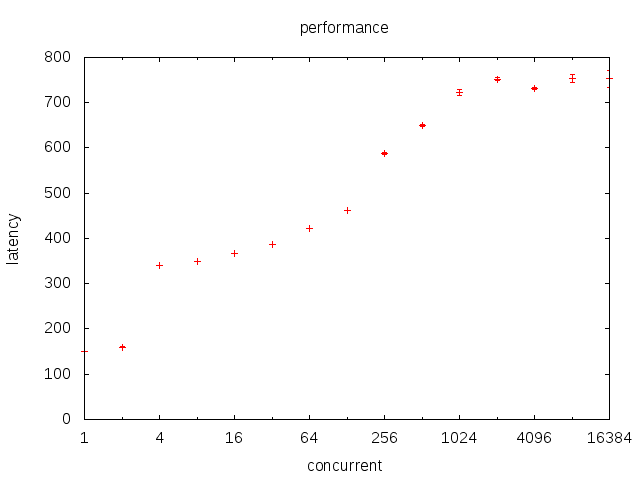
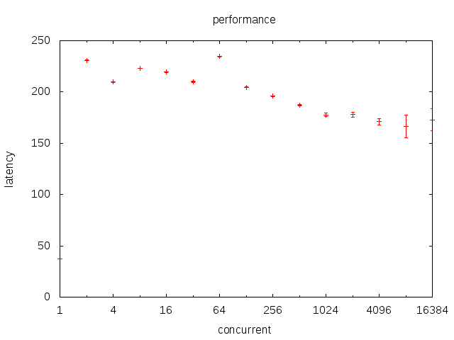
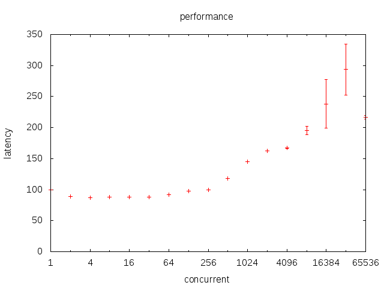
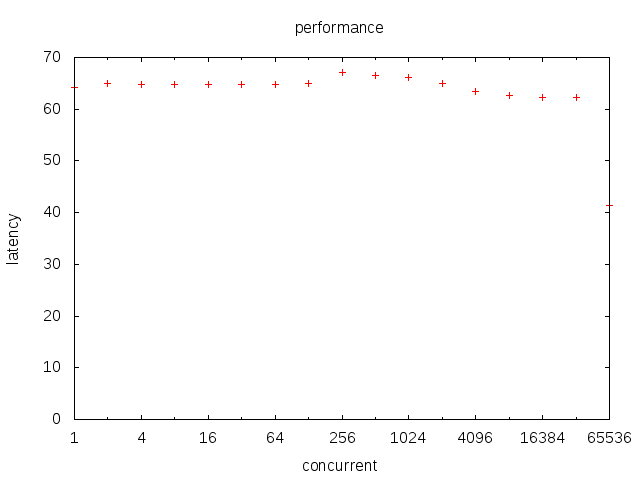
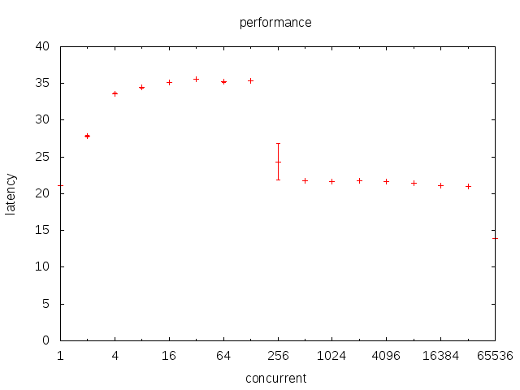

# 上下文切换技术简介

## logo

## 自我介绍

shell909090，七牛程序员，主要用python和golang。

## LICENSE

[cc-by-sa3.0](http://creativecommons.org/licenses/by-sa/3.0/deed.zh)

# 系统级上下文技术

## 术语

* 上下文
  * 调用栈
  * 指向栈的寄存器
* 切换
  * 当前执行的一个上下文变为另一个上下文
  * 不是上下文的创建和消灭，而是上下文获得CPU时间
* 调度
  * 决定哪个上下文应当获得CPU了
* 进程
  * 分配资源的单位
* 线程
  * 分配CPU的单位

## 进程状态

* 运行: 得到CPU
* 就绪: 可以得到CPU，但是尚未调度到
* 睡眠: 等待某些条件，因此获得了CPU也没用

## 性能

* fork的开销在40-50us不等
* pthread(nptl)的开销在9.5us左右

# 传统网络服务模型

## 如何工作

1. 父进程监听服务端口
2. 在有新连接建立的时候，父进程执行fork，产生一个子进程副本
3. 如果子进程需要的话，可以exec(例如CGI)
4. 父进程执行到accept后，发生阻塞
5. 上下文调度，内核调度器选择下一个上下文，一般就是刚派生的子进程
6. 子进程进程进入读取处理状态，阻塞在read调用上，所有上下文均进入睡眠态
7. 随着SYN或者数据报文到来，CPU会唤醒对应fd上阻塞的上下文
8. 上下文切换到就绪态，并加入调度队列
9. 继续执行到下一个阻塞调用，或者因为时间片耗尽被挂起

## fork的细节

产生当前进程的同等副本，在fork时并不立刻分配新的资源。

而是在其中某个进程执行了写入时发生复制，这叫做COW。

理论上fork应当先执行子进程，因为有很大可能执行exec。

而exec执行的快可以避免COW。

## 阻塞-调度的细节

* 当试图读取数据而无数据可读时，既不能得到数据也不能返回。
* 此时上下文处于等待某些条件的状态。
* 在此种条件下，上下文不参与调度。系统会自动选择一个就绪的上下文去切换。
* 当前上下文被挂入等待条件的wait_queue队列。

* 当条件就绪，例如收到网络数据的时候，会唤醒wait_queue上挂起的所有上下文。
* 不能只唤醒一个。
* 因为如果一个上下文不能消费所有数据，会使得剩余上下文无谓阻塞。
* 但是如果数据只够一个上下文消费，会发生惊群。

## 评价

* 同步模型编写自然，每次读取数据可以当作必然能读取到。
* 进程模型隔离性好，每个上下文可以当作其他上下文不存在一样的操作。
* 即使程序复杂且易崩溃，也只影响一个连接而不是在整个系统。
* 生成和释放开销很大，需要考虑复用。
* 进程模式的多客户通讯比较麻烦，尤其在共享大量数据的时候。

# C10K问题

## 上下文重复建立开销

通过上下文池和复用上下文解决。

上下文不销毁，而是从头开始循环，获得下一个请求并处理。

## 线程复用模式的问题

线程复用模式仍然不够快，往往会被认为以下两个因素。

* 内存
* 内核陷入

## linux栈分配原理

linux下只为栈保留地址空间，而不映射内存。

当地址空间首次被访问时，才分配物理内存。因此大量线程不会消耗无谓内存。

8M是最大内存限制。

当栈回退时，物理页面映射不释放。

## 内核陷入开销

很小，最低只有50ns。而普通函数调用也有2ns。

而且现代高效模型也要通过read陷入来获得数据，这个开销未能避免。

## 内核调度器

1. linux2.4的调度器。
2. O(1)调度器。
3. CFS。

## 开销

yield每次耗费的时间随活跃线程数变化曲线

---

lock每次耗费的时间随活跃线程书变化曲线

## lock消耗为什么不随着活跃线程数上升

因为lock调用futex，而将线程至于睡眠态。

# 多路复用

## 简述

* 要突破C10K，就要减少活跃上下文数。因此一个上下文必须能处理多个连接。
* 因此系统调用时必须立刻返回。否则会塞住上下文，阻碍复用。
* 非阻塞调用可以做到立刻返回，但是如何选择要读的文件句柄？

## 就绪通知 vs 异步IO

* 由用户读取 vs 由系统回调
* 在数据就绪时通知 vs 在数据IO完成后回调

## linux的就绪通知发展

* select: 每次调用需要传入fd数组，有最大限制
* poll: 每次调用需要传入fd数组，无最大限制
* epoll: 每次调用无需传入数组，没有最大限制

## epoll

* ET: 状态转变时触发
* LT: 读取所有就绪句柄

## 性能分析

* epoll_wait/ep\_poll\_callback: O(1)级
* epoll_ctl: O(logn)级

## 固有缺陷

无法用于普通文件。

# 事件通知机制下的程序设计模型

## 用户态调度

知道了哪些fd就绪，如何处理这些fd？

将对应fd映射到处理这个fd的某组过程上的结构设计，被称为用户态调度。

这样，当我们知道某个fd就绪时，可以激活对应的过程。

更广义的说，各种内核态带有wait\_queue的对象，在用户态调度上都要做类似处理。

例如时钟和锁。

---

因此用户态调度可类比于内核态调度，但是用户态调度没有抢占。

当这个过程长期执行不返回时，其他句柄不能被及时处理。

用公平性换取效率。

## coroutine

切换机器状态字和执行栈不需要进入内核，这也是用户态上下文切换的核心思想。

setjmp/longjmp只能切换状态字，而没有独立的执行栈。

因此setjmp/longjmp用于coroutine总是有点问题，建议用ucontext。

greenlet也是利用新建独立执行栈和替换当前栈顶部frame的方法来切换。

## 协程和线程的关系和区别

* 协程要获得CPU，必须在线程中执行
* 协程无法跨进程调度
* 同时执行的协程数不能大于容纳他的线程数
* 协程没有抢占

因此，单线程中执行的协程，可以视为单线程应用。

在阻塞调用之间，访问数据对象时是不需要加锁的。

## golang协程性能

sched调用延迟随goroutine数变化

---

chan调用延迟随goroutine数变化

---

lock调用延迟随goroutine数变化

## python协程性能

* yield的开销大约是22ns
* greenlet的开销大约是500ns

---

yield from随层数变化

## 基于就绪通知的协程框架

1. 包装read/write，检查返回。
2. 如果是EAGAIN，将当前协程绑定到fd上，然后执行调度函数。
2. 调度函数epoll，读一个就绪的fd。如果没有，阻塞直到至少一个fd就绪。
3. 查找这个fd对应的协程上下文对象，并切换过去。
4. 当某个协程被切换到时，应当再重试读取，失败的话重复2。
5. 如果读取到数据了，返回。

---

这样，异步的数据读写动作，在我们的想像中就可以变为同步的。

而同步模型会极大降低我们的编程负担。

## 回调模型

所谓回调模型就是，在IO调用的时候，同时传入一个函数，作为返回函数。

当IO结束时，调用传入的函数来处理下面的流程。

## CPS

用一句话来描述CPS——他把一切操作都当作了IO。

无论干什么，结果要通过回调函数来返回。

从这个角度来说，IO回调模型只能被视作CPS的一个特例。

	add = lambda f, *nums: f(sum(nums))
	mul = lambda f, *nums: f(reduce(lambda x,y: x*y, nums))
	mul(lambda x: add(pprint.pprint, x, 1), 2, 3)

## 函数组件和返回值

函数为什么要用栈来描述层级调用关系？

* 因为函数必须等待返回值或者同步顺序。
* 因此调用者的状态需要被保存，换入被调用者执行，直到返回时再换回。
* 这个角度来说，调用是最朴素而原始的上下文切换手段。
* 无需同步的调用可以用mq来解藕。
* 而CPS则象征另一个极端。函数的返回值可以不返回调用者，而是第三者。

# Q&A
